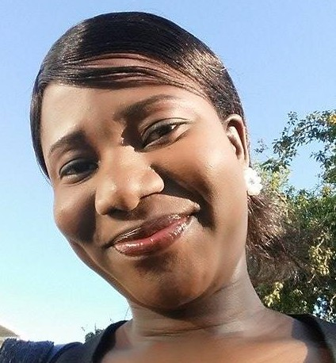

# Homework 1 repository (Jummy David)

### Welcome to my [STAT545](https://github.com/STAT545-UBC) homework1 repository.

#### My repo is structured as follows:

|   **Documents**   | **Description** |
|----------------|------------|
|[README.md](https://github.com/STAT545-UBC-students/hw01-funkedavid82/blob/master/README.md)|Readme.md file gives a brief description of all I have in the homework1 folder |
|[hw01_Rabbit.md](https://github.com/STAT545-UBC-students/hw01-funkedavid82/blob/master/hw01_Rabbit.md)      | Visualizing and exploring the gapminder dataset in R   |


## About me
My name is *Jummy David*, a PhD student in [Interdisciplinary studies](http://isgp.ubc.ca/) at [UBC](https://www.ubc.ca/). I hold a Bachelor of Technology degree in Mathematics and Master of Science degree in Applied Mathematics.



## My Research
  My research interests are in mathematical epidemiology, which includes:
  
- modeling of infectious and sexually transmitted diseases e.g HIV, TB, STIs and Malaria to mention a few. 

- Analysing clinical data to inform stakeholders on policy making and best treatment strategy.

I currently work under the supervision of two able Professors, [Professor Fred Brauer](http://www.math.ubc.ca/~cytryn/MathBio/brauer.php) from the Department of mathematics and [Professor Viviane Dia Lima](https://medicine.med.ubc.ca/profiles/viviane-dias-lima/) from the Deprtment of Medicine. Working with two Department has added so much value to me and I am so in love with the interdisciplinary nature of my research. I work $3$ days at [UBC Mathematics Department](https://www.math.ubc.ca/) and $2$ days at [British Columbia Centre for Excellence in HIV/AIDS](http://cfenet.ubc.ca/) in [St. Paul's Hospital](http://www.providencehealthcare.org/hospitals-residences/st-paul%27s-hospital)

Here are the days I am available on UBC campus, incase you wish to drop by:

| **Day**    | **Hour**             |
|------------|----------------------|
| Monday     | 9am - 4pm            |
| Tuesday    | 11am-12noon, 4am-5pm |
| Thursday   | 11am-12noon, 4am-5pm |

Please feel free to email me at <jummy30@math.ubc.ca>

####Writing math in between lines and Sample code
- you can write math in between lines as `x+y = 1`.

- or embed code as:
```R
barplot(table(sample(1:3, size=1000, replace=TRUE, prob=c(.30,.60,.10))), xlab="Sample", ylab="Size")
```
##To-Dos
- [x] Edit the README
- [x] Work on Rabbit dataset
- [ ] git push
