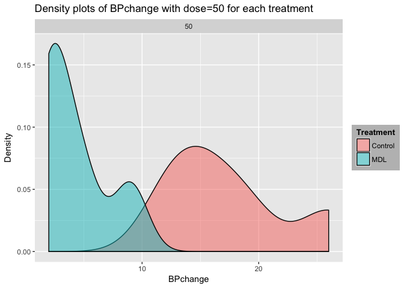

   keep_md: yes
# Description: 

The dataset is the study of five rabbits on two different occasions, after treatment with saline (control) and after treatment with the 5-HT_3 antagonist MDL 72222. Doses of phenylbiguanide were injected intravenously at 10 minute intervals in ascending order for each control and MDL. The change in blood pressure of the $5$ rabbits were measured. Variables are described from the [Source](https://stat.ethz.ch/R-manual/R-devel/library/MASS/html/Rabbit.html) as

- **BPchange**: change in blood pressure.
- **Dose**: dose of Phenylbiguanide in micrograms.
- **Run**: label of run ("C1" to "C5", then "M1" to "M5").
- **Treatment**: placebo (control) or the 5-HT_3 antagonist MDL 72222 (MDL).
- **Animal**: label of animal used ("R1" to "R5").


# Goal:

The aim of this work is to know whether change in blood pressure (cardiogenic chemoreflex) triggered by phenylbiguanide doses is related to treatment with MDL. In other words, we want to know if BPchange of MDL is significantly different/higher than that of control among all animals(rabbits) for each of the $6$ doses.

# Data frame exploration

# Setting up:

First, to load the `Rabbit` R package, run `install.packages("MASS")` in the console first. 


```r
require(plyr)
```

```
## Loading required package: plyr
```

```r
library(dplyr)
```

```
## Warning: package 'dplyr' was built under R version 3.3.2
```

```
## 
## Attaching package: 'dplyr'
```

```
## The following objects are masked from 'package:plyr':
## 
##     arrange, count, desc, failwith, id, mutate, rename, summarise,
##     summarize
```

```
## The following objects are masked from 'package:stats':
## 
##     filter, lag
```

```
## The following objects are masked from 'package:base':
## 
##     intersect, setdiff, setequal, union
```

```r
library(ggplot2)
```

```
## Warning: package 'ggplot2' was built under R version 3.3.2
```

```r
library(MASS)
```

```
## Warning: package 'MASS' was built under R version 3.3.2
```

```
## 
## Attaching package: 'MASS'
```

```
## The following object is masked from 'package:dplyr':
## 
##     select
```

# Exploration of Rabbit data frames

Let's explore `Rabbit` with functions like `head`, `ncol`, `str`, `summary`.


```r
head(Rabbit) #shows the first 6 rows of the data
```

```
##   BPchange   Dose Run Treatment Animal
## 1      0.5   6.25  C1   Control     R1
## 2      4.5  12.50  C1   Control     R1
## 3     10.0  25.00  C1   Control     R1
## 4     26.0  50.00  C1   Control     R1
## 5     37.0 100.00  C1   Control     R1
## 6     32.0 200.00  C1   Control     R1
```

```r
str(Rabbit) # shows the dataset in a string form
```

```
## 'data.frame':	60 obs. of  5 variables:
##  $ BPchange : num  0.5 4.5 10 26 37 32 1 1.25 4 12 ...
##  $ Dose     : num  6.25 12.5 25 50 100 200 6.25 12.5 25 50 ...
##  $ Run      : Factor w/ 10 levels "C1","C2","C3",..: 1 1 1 1 1 1 2 2 2 2 ...
##  $ Treatment: Factor w/ 2 levels "Control","MDL": 1 1 1 1 1 1 1 1 1 1 ...
##  $ Animal   : Factor w/ 5 levels "R1","R2","R3",..: 1 1 1 1 1 1 2 2 2 2 ...
```

```r
ncol(Rabbit) #shows the number of column of variables
```

```
## [1] 5
```

```r
tail(Rabbit) #shows the last 6 rows of the data
```

```
##    BPchange   Dose Run Treatment Animal
## 55      2.4   6.25  M5       MDL     R5
## 56      2.5  12.50  M5       MDL     R5
## 57      1.5  25.00  M5       MDL     R5
## 58      2.0  50.00  M5       MDL     R5
## 59      9.0 100.00  M5       MDL     R5
## 60     19.0 200.00  M5       MDL     R5
```

```r
dim(Rabbit) #shows the number of variables in the column and the total number of observations in the row
```

```
## [1] 60  5
```

```r
names(Rabbit) #shows the name of the all variables
```

```
## [1] "BPchange"  "Dose"      "Run"       "Treatment" "Animal"
```

```r
summary(Rabbit) #summary statistics of the dataset
```

```
##     BPchange          Dose             Run       Treatment  Animal 
##  Min.   : 0.50   Min.   :  6.25   C1     : 6   Control:30   R1:12  
##  1st Qu.: 1.65   1st Qu.: 12.50   C2     : 6   MDL    :30   R2:12  
##  Median : 4.75   Median : 37.50   C3     : 6                R3:12  
##  Mean   :11.22   Mean   : 65.62   C4     : 6                R4:12  
##  3rd Qu.:20.50   3rd Qu.:100.00   C5     : 6                R5:12  
##  Max.   :37.00   Max.   :200.00   M1     : 6                       
##                                   (Other):24
```

## Extracting columns/"variables"

Let's extract a column with `$`. This first column contains the change in blood pressure of all animals


```r
Rabbit$BPchange
```

```
##  [1]  0.50  4.50 10.00 26.00 37.00 32.00  1.00  1.25  4.00 12.00 27.00
## [12] 29.00  0.75  3.00  3.00 14.00 22.00 24.00  1.25  1.50  6.00 19.00
## [23] 33.00 33.00  1.50  1.50  5.00 16.00 20.00 18.00  1.25  0.75  4.00
## [34]  9.00 25.00 37.00  1.40  1.70  1.00  2.00 15.00 28.00  0.75  2.30
## [45]  3.00  5.00 26.00 25.00  2.60  1.20  2.00  3.00 11.00 22.00  2.40
## [56]  2.50  1.50  2.00  9.00 19.00
```

```r
min(Rabbit$BPchange)
```

```
## [1] 0.5
```

```r
max(Rabbit$BPchange)
```

```
## [1] 37
```


```r
Rabbit$Dose
```

```
##  [1]   6.25  12.50  25.00  50.00 100.00 200.00   6.25  12.50  25.00  50.00
## [11] 100.00 200.00   6.25  12.50  25.00  50.00 100.00 200.00   6.25  12.50
## [21]  25.00  50.00 100.00 200.00   6.25  12.50  25.00  50.00 100.00 200.00
## [31]   6.25  12.50  25.00  50.00 100.00 200.00   6.25  12.50  25.00  50.00
## [41] 100.00 200.00   6.25  12.50  25.00  50.00 100.00 200.00   6.25  12.50
## [51]  25.00  50.00 100.00 200.00   6.25  12.50  25.00  50.00 100.00 200.00
```

```r
min(Rabbit$Dose)
```

```
## [1] 6.25
```

```r
max(Rabbit$Dose)
```

```
## [1] 200
```

## Change in blood pressure with the dose use
There does seem to be a relationship between change in blood pressure and dose based on the side-by-side boxplot, i.e increasing the doses cause the change in blood pressure to increase. The higher the dose, the more the BPchange.


```r
attach(Rabbit)
par(mfrow=c(1,1))
boxplot(BPchange~Dose, data=Rabbit, col=(c("blue","red")),main="BPchange vs Doses",ylab="BPchange", xlab="Dose")
```

<!-- -->

## Change in BPchange versus Run
There seem to be a relationship between change in blood pressure and label of run.


```r
ggplot(aes(x = Run, y = BPchange), data =Rabbit) +
geom_boxplot(fill = "slategray1") +
ggtitle("BPchange vs run")+theme(plot.title = element_text(hjust = 0.5))
```

<!-- -->

```r
boxplot(BPchange~Run, data=Rabbit, ylab="BPchange", main="BPchange vs Run", las=1, col=c(4,5,3,6,2,"lightpink",8,"purple","forestgreen"), xlab="Run")
```

<!-- -->

## Change in BPchange versus Treatment
Control group seems to have a higher change in blood pressure and we need to know the baseline values of their respective blood pressures to know if MDL increases BP.


```r
boxplot(BPchange~Treatment, data=Rabbit, ylab="BPchange", names=c("Control","MDL"), main="BPchange vs Treatment", las=1, col=c(4,2), xlab="Treatment")
```

<!-- -->

```r
ggplot(aes(x = Treatment, y = BPchange), data =Rabbit) +
geom_boxplot(fill = "slategray1") +
ggtitle("Change in BP among all animals")+theme(plot.title = element_text(hjust = 0.5))
```

<!-- -->
## Change in BPchange versus Animal
In general, $R_1$ have the highest BPchange with $R_5$ being the lowest.

```r
boxplot(BPchange~Animal, data=Rabbit, ylab="BPchange", names=c("R1l","R2", "R3","R4", "R5"), main="BPchange vs Animal", las=1, col=c(4,2,5,6,3), xlab="Animal")
```

<!-- -->

```r
ggplot(aes(x = Animal, y = BPchange), data =Rabbit) +
geom_boxplot(fill = "slategray1") +
ggtitle("Change in BP among all animals")+theme(plot.title = element_text(hjust = 0.5))
```

<!-- -->

## Change in blood pressure versus dose use, and stratified by treatment type (Control/MDL)
It is worth nothing that stratifying the dose according to different treatment may give us a better interpretation of the relationship. Comparing the control group of $6$ different doses on the left side and MDL group on the right side, we have;

- Increase in change in blood pressure as a result of ascending increase in doses.
- The control group may generally have a lower BPchange at baseline compared to the MDL group, which may mean different things:

1. MDL increases blood pressure and say that the drug does not work.
2. Animal on MDL may generally have a high blood pressure.
3. There may be report bias.


```r
boxplot(BPchange~Dose*Treatment, data=Rabbit, col=(c("blue","red","pink","forestgreen","purple","orange")), main="Change in blood pressure vs Dose and by treatment",ylab="BPchange", xlab="Dose")
legend(x=0.5, y=35, legend=c("6.25", "12.50", "25", "50", "100", "200"), col=(c("blue","red","pink","forestgreen","purple","orange")), bty="n", lwd=3)
```

<!-- -->

## Change in blood pressure versus Treatment and by dose
This confirms that control group in colour blue (for dose $=12.5, 25, 50, 100, 200$) have higher change in blood pressure compared to the MDL group in colour red. While reverse happens to be the case when dose$=6.25$.


```r
boxplot(BPchange~Treatment*Dose, data=Rabbit, col=(c("blue","red")), main="Change in blood pressure vs Treatment and by Dose",ylab="BPchange", xlab="Treatment")
legend(x=0.5, y=35, legend=c("Control", "MDL"), col=(c("blue","red")), bty="n", lwd=3)
```

<!-- -->

## Relation between change in blood pressure and animal type
Animals in the control group generally have a higher change in blood pressure except for $R_2$ animals.


```r
boxplot(BPchange~Treatment*Animal, ylab="BPchange", main="BPchange vs Treatment, stratified by Animal type", col=c(4,2), las=1, axes=T, xlab="Treatment")
legend(x=8, y=35, legend=c("Control", "MDL"), col=c(4,2), bty="n", lwd=3)
```

<!-- -->

## Relation between change in blood pressure and animal type, adjusting for dose
Animals on doses$=50,100$ experince a higher change in blood pressure.

```r
ggplot(data = Rabbit, aes(x = Animal, y = BPchange)) +
  geom_boxplot(fill = "slategray1") +
  facet_wrap(~Dose)
```

<!-- -->
  
## Relation between change in blood pressure and dose use
There does seem to be a fairly strong linear relationship between BPchange and dose use
based on this scatterplot and the pearson’s correlation cor(BPchange,Dose)=0.831961. The higher the dose, the larger the BPchange, i.e. Rabbits with higher doses have higher change in bloo pressure, with dose$=100$ giving the maximum effectiveness.


```r
plot(Dose, BPchange, data=Rabbit, main="Scatter plot of BPchange vs Dose", xlab="Dose", ylab="BPchange", las=1, pch="s", col=6)
```

```
## Warning in plot.window(...): "data" is not a graphical parameter
```

```
## Warning in plot.xy(xy, type, ...): "data" is not a graphical parameter
```

```
## Warning in axis(side = side, at = at, labels = labels, ...): "data" is not
## a graphical parameter

## Warning in axis(side = side, at = at, labels = labels, ...): "data" is not
## a graphical parameter
```

```
## Warning in box(...): "data" is not a graphical parameter
```

```
## Warning in title(...): "data" is not a graphical parameter
```

```r
abline(lm(BPchange~Dose), col=3, lty=2, lwd=6)
lines(smooth.spline(Dose,BPchange), lty=2, lwd=5)
```

<!-- -->

```r
cor(BPchange,Dose)
```

```
## [1] 0.831961
```

## Scatter plot to show the change in blood pressure with dose use and by treatment type (Control/MDL)

There seems to be a wider variation in the change in blood pressure and especially in the middle. The control BPchange in blue seems higher than MDL in red. Then there seems to be no significant diffrent in the change in blood pressure of the control group with doses $100$ and $200$. 


```r
plot(Dose[Treatment=="Control"], BPchange[Treatment=="Control"], col=4, xlab="Dose", ylab="BPchange", main="Change in blood pressure vs Dose and by Treatment", pch=16)
points(Dose[Treatment=="MDL"], BPchange[Treatment=="MDL"], col=2, pch=17)
lines(smooth.spline(Dose[Treatment=="Control"], BPchange[Treatment=="Control"]), col=4, lwd=3, lty=2)
lines(smooth.spline(Dose[Treatment=="MDL"], BPchange[Treatment=="MDL"]), col=2, lwd=3, lty=3)
legend(x=2.5, y=35, legend=c("Control", "MDL"), col=c(4,2), lty=c(2,3), bty="n", lwd=3)
```

<!-- -->

## Density plots of BPchange by Treatment

### Dose$=6.25$

Change in blood pressure with a higher density occurs among the control group.


```r
par(mfrow=c(3,2))

BP_6.25<- Rabbit %>% 
 filter(Dose == 6.25) 
```

```
## Warning: package 'bindrcpp' was built under R version 3.3.2
```

```r
BP_6.25 %>%
 ggplot(aes(x = BPchange, fill = Treatment)) + facet_wrap(~Dose) + geom_density(alpha = 0.5) + ggtitle("Density plots of BPchange with dose=6.25 for each treatment") + theme(legend.title = element_text(color = "black", size = 10, face = "bold"), legend.background = element_rect(fill = "gray",
 size = 0.3,
 linetype = "dashed")) +
 labs(x="BPchange", y="Density")
```

<!-- -->

### Dose$=12.50$

Change in blood pressure with a higher density occurs among the MDL group.


```r
BP_12.50<- Rabbit %>% 
 filter(Dose == 12.50) 
BP_12.50 %>%
 ggplot(aes(x = BPchange, fill = Treatment)) + facet_wrap(~Dose) + geom_density(alpha = 0.5) + ggtitle("Density plots of BPchange with dose=12.50 for each treatment") + theme(legend.title = element_text(color = "black", size = 10, face = "bold"), legend.background = element_rect(fill = "gray",
 size = 0.3,
 linetype = "dashed")) +
 labs(x="BPchange", y="Density")
```

<!-- -->

### Dose$=25$

Change in blood pressure with a higher density occurs among the MDL group.


```r
BP_25<- Rabbit %>% 
 filter(Dose == 25) 
BP_25 %>%
 ggplot(aes(x = BPchange, fill = Treatment)) + facet_wrap(~Dose) + geom_density(alpha = 0.5) + ggtitle("Density plots of BPchange with dose=25 for each treatment") + theme(legend.title = element_text(color = "black", size = 10, face = "bold"), legend.background = element_rect(fill = "gray",
 size = 0.3,
 linetype = "dashed")) +
 labs(x="BPchange", y="Density")
```

<!-- -->

### Dose$=50$

Change in blood pressure with a higher density occurs among the MDL group.


```r
BP_50<- Rabbit %>% 
 filter(Dose == 50) 
BP_50 %>%
 ggplot(aes(x = BPchange, fill = Treatment)) + facet_wrap(~Dose) + geom_density(alpha = 0.5) + ggtitle("Density plots of BPchange with dose=50 for each treatment") + theme(legend.title = element_text(color = "black", size = 10, face = "bold"), legend.background = element_rect(fill = "gray",
 size = 0.3,
 linetype = "dashed")) +
 labs(x="BPchange", y="Density")
```

<!-- -->

### Dose$=100$

There is no significantly difference in the density of the change in blood pressure among both group.


```r
BP_100<- Rabbit %>% 
 filter(Dose == 100) 
BP_100 %>%
 ggplot(aes(x = BPchange, fill = Treatment)) + facet_wrap(~Dose) + geom_density(alpha = 0.5) + ggtitle("Density plots of BPchange with dose=100 for each treatment") + theme(legend.title = element_text(color = "black", size = 10, face = "bold"), legend.background = element_rect(fill = "gray",
 size = 0.3,
 linetype = "dashed")) +
 labs(x="BPchange", y="Density")
```

<!-- -->

### Dose$=200$

MDL group have a higher density in change in blood pressure 


```r
BP_200<- Rabbit %>% 
 filter(Dose == 200) 
BP_200 %>%
 ggplot(aes(x = BPchange, fill = Treatment)) + facet_wrap(~Dose) + geom_density(alpha = 0.5) + ggtitle("Density plots of BPchange with dose=200 for each treatment") + theme(legend.title = element_text(color = "black", size = 10, face = "bold"), legend.background = element_rect(fill = "gray",
 size = 0.2,
 linetype = "dashed")) +
 labs(x="BPchange", y="Density")
```

<!-- -->

## Density plots of BPchange by Treatment
The density of animal with change in blood pressure is generally higher in MDL group relative to the control group.


```r
Rabbit %>% 
  ggplot(aes(x = BPchange)) +
    geom_density(fill = "slategray1") +
    facet_grid(Animal ~ Treatment)
```

<!-- -->


## Barplot of change in blood pressure versus dose, adjusting for treatment type and animal

Among all animals, there seems to be a relationship between change in blood pressure and level of dose. BPchange increases with increase in dose among all rabbit for all treatment type. Animal $R_1$ have the highest BPchange and $R_5$ have the lowest. No significantly difference in the BPchange of animal $R_3$ when dose$=100, 200$.

Also, since the p-valueof the relationship between BPchange and treatment is $0.1151791> 0:05$, we conclude that we have evidence to believe that there really is no significant difference in the change in blood pressure of the $5$ groups.


```r
ggplot(Rabbit, aes(fill=Treatment, y=BPchange, x=Animal)) + 
    geom_bar(position="dodge", stat="identity")
```

<!-- -->

```r
ggplot(Rabbit, aes(fill=Animal, y=BPchange, x=Dose)) + 
    geom_bar(position="dodge", stat="identity")
```

<!-- -->

```r
ggplot(Rabbit, aes(fill=Animal, y=BPchange, x=Treatment)) + 
    geom_bar(position="dodge", stat="identity")
```

<!-- -->

```r
ggplot(Rabbit, aes(y=BPchange, x=Dose, color=Animal, fill=Treatment)) + 
    geom_bar( stat="identity") +    
    facet_wrap(~Animal)
```

<!-- -->

```r
ggplot(Rabbit, aes(y=BPchange, x=Animal, color=Animal, fill=Treatment)) + 
    geom_bar( stat="identity") +    
    facet_wrap(~Dose)
```

<!-- -->

```r
t.test(Dose,BPchange, mu=0, alt="two.sided", paired=T, conf.level=0.95)
```

```
## 
## 	Paired t-test
## 
## data:  Dose and BPchange
## t = 7.1378, df = 59, p-value = 1.581e-09
## alternative hypothesis: true difference in means is not equal to 0
## 95 percent confidence interval:
##  39.15438 69.65895
## sample estimates:
## mean of the differences 
##                54.40667
```

```r
Ttest=t.test(BPchange~Treatment)
Ttest
```

```
## 
## 	Welch Two Sample t-test
## 
## data:  BPchange by Treatment
## t = 1.5999, df = 56.771, p-value = 0.1152
## alternative hypothesis: true difference in means is not equal to 0
## 95 percent confidence interval:
##  -1.17821 10.53821
## sample estimates:
## mean in group Control     mean in group MDL 
##             13.558333              8.878333
```

```r
attributes(Ttest)
```

```
## $names
## [1] "statistic"   "parameter"   "p.value"     "conf.int"    "estimate"   
## [6] "null.value"  "alternative" "method"      "data.name"  
## 
## $class
## [1] "htest"
```

```r
Ttest$conf.int
```

```
## [1] -1.17821 10.53821
## attr(,"conf.level")
## [1] 0.95
```

```r
Ttest$p.value
```

```
## [1] 0.1151791
```
